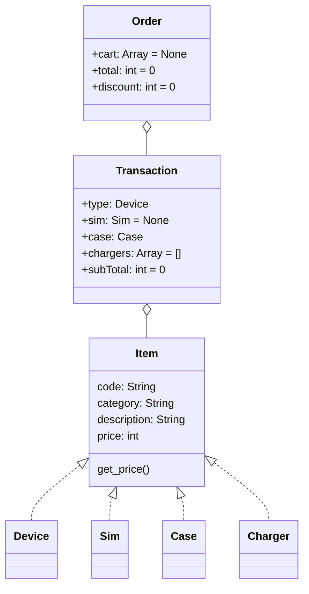

# Headline

> :fire: An awesome project.

```mermaid
classDiagram
    Item <|.. Device
    Item <|.. Sim
    Item <|.. Case
    Item <|.. Charger
    
    Order o-- Transaction
    
    Transaction o-- Item
    
    class Item {
      code: String
      category: String
      description: String
      price: int
      get_price()
    }
    
    class Order {
      +cart: Array<Transaction> = None
      +total: int = 0
      +discount: int = 0
    }
    
    class Transaction {
      +type: Device
      +sim: Sim = None
      +case: Case
      +chargers: Array<Charger> = []
      +subTotal: int = 0
    }
```