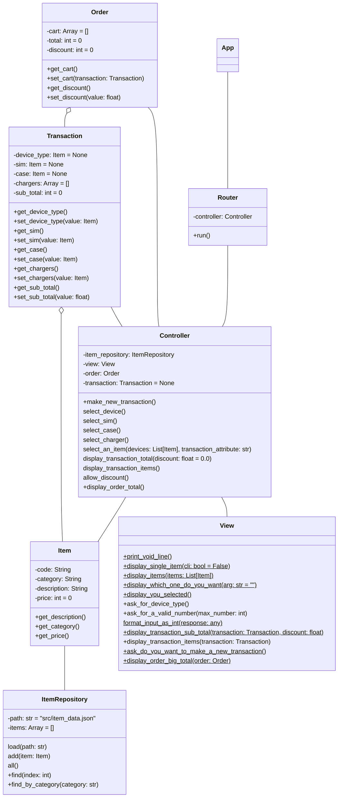

# Terminal shop app

> :information_source: Get sources with:
> ```bash
> git clone git@github.com:matbgn/terminal-shop.git
>```
 
> :fire: This app require python 3.6+

## Usage
Run app with:
```bash
cd terminal-shop
python app.py
```

## Class Diagram



## Item Repository
> :bulb: Store in `item_data.json` and load with ItemRepository constructor

| Id | Category | Item code | Description                                  | Price ($) |
|----|----------|-----------|----------------------------------------------|-----------|
| 1  | Phone    | BPCM      | Compact                                      | 29.99     |
| 2  | Phone    | BPSH      | Clam shell                                   | 49.99     |
| 3  | Phone    | RPSS      | Robo phone - 5inch 64GB memory               | 199.99    |
| 4  | Phone    | RPLL      | Robo phone - 6inch 256GB memory              | 499.99    |
| 5  | Phone    | YPLS      | Y-phone standard 6 inch 64GB memory          | 549.99    |
| 6  | Phone    | YPLL      | Y-phone deluxe 6 inch 256GB memory           | 649.99    |
| 7  | Tablet   | RTMS      | RoboTab - 8 inch screen 64GB memory          | 149.99    |
| 8  | Tablet   | RTML      | RoboTab - 10 inch screen 128GB memory        | 299.99    |
| 9  | Tablet   | YTLM      | Y-tab standard - 10 inch screen 128GB memory | 499.99    |
| 10 | Tablet   | YTLL      | Y-tab deluxe - 10 inch screen 256GB memory   | 599.99    |
| 11 | SIM card | SMNO      | Sim free (no SIM card)                       | 0.00      |
| 12 | SIM card | SMPG      | Pay as you go (with SIM card)                | 9.99      |
| 13 | Case     | CSST      | Standard                                     | 0.00      |
| 14 | Case     | CSLX      | Luxury                                       | 50.00     |
| 15 | Charger  | CGCR      | Car                                          | 19.99     |
| 16 | Charger  | CGHM      | Home                                         | 15.99     |
                
**Grand-total = 3625.87**